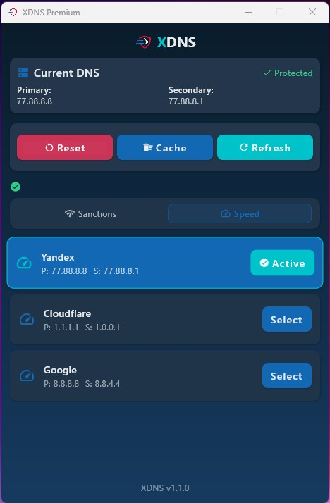

# XDNS

**XDNS** is a streamlined, powerful DNS configuration utility for Windows that helps you easily bypass network restrictions and optimize your internet connection. With its modern, sleek interface built using Compose Multiplatform Desktop, XDNS makes managing DNS settings straightforward for both technical and non-technical users.

## Key Features

- **Specialized DNS Categories**:
  - **Sanctions DNS**: Quickly connect to DNS servers that bypass network restrictions
  - **Speed DNS**: Use performance-optimized DNS servers from major providers (Cloudflare, Google, etc.)

- **Easy DNS Management**:
  - One-click application of DNS settings
  - Clear visual indication of currently active DNS
  - Detailed view of primary and secondary DNS addresses

- **Quick System Tools**:
  - Reset DNS to DHCP defaults
  - Clear DNS cache to resolve connectivity issues 
  - Refresh status to verify current DNS configuration

- **Modern User Experience**:
  - Clean, intuitive interface
  - Status indicators for all operations
  - Seamless category switching
  - Simple administrator privileges management

## Requirements

- **Windows**: Designed specifically for Windows operating systems
- **Administrator Privileges**: Required to modify system DNS settings
  - A launcher script is included to automatically request admin privileges

## Installation

1. **Download**: Get the latest release from the [Releases](https://github.com/hadibtf/XDNS/releases) page
2. **Installation Options**:
   - `.exe`: Standalone executable installer
   - `.msi`: Windows Installer package (recommended)
3. **Administrator Setup**:
   - After installation, locate the `RunXDNS.bat` file in the installation directory
   - Create a shortcut to this batch file on your desktop
   - Use this shortcut to launch XDNS with administrator privileges

## Usage Guide

1. **Launch**: Always use the `RunXDNS.bat` file or its shortcut to start the application
2. **View Current DNS**: Check your active DNS configuration at the top of the application
3. **Select DNS Type**: Choose between "Sanctions" or "Speed" categories
4. **Apply DNS**: Click "Select" on any DNS server to apply it to your system
5. **Manage DNS**: Use the control buttons to reset, clear cache, or refresh status

## Screenshots

## Why XDNS?

- **Simplified Network Management**: No need to navigate complex Windows network settings
- **Quick Access**: Instantly switch between different DNS configurations
- **User-Friendly**: Designed for everyday users who need DNS flexibility without technical complexity
- **Hassle-Free Administration**: Included batch file automatically elevates privileges when needed

## License

This project is licensed under the MIT License. See the [LICENSE](LICENSE) file for details.
