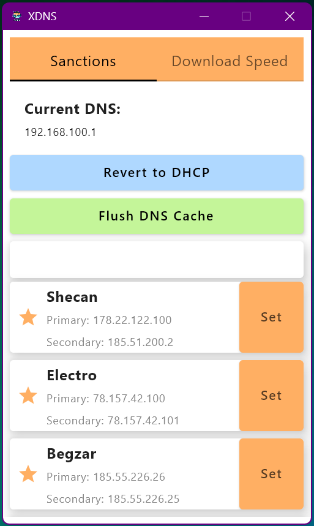

# XDNS

**XDNS** is a Compose Multiplatform Desktop application designed for efficient DNS management on Windows. It provides multiple predefined DNS configurations and the ability to flush the DNS cache, making network troubleshooting and optimization simpler than ever.

## Features

- **Predefined DNS Configurations**: Easily switch between several DNS setups.
- **DNS Cache Flush**: Quickly flush the Windows DNS cache.
- **User-Friendly Interface**: Built with Compose Multiplatform Desktop for a modern, responsive UI.
- **Windows Integration**: Specifically tailored to modify DNS settings on Windows.

## Requirements

- **Operating System**: Windows
- **Administrator Privileges**:
    - **Installation**: Does not require administrator rights.
    - **Running the Application**: When launching the app via its shortcut, you must run it as Administrator.  
      _Tip: Right-click on the shortcut and select "Run as administrator"._

## Installation

XDNS is available as both an `.exe` and an `.msi` installer.

1. **Download**: Get the latest release from the [Releases](https://github.com/hadibtf/XDNS/releases/tag/v1.0.0) page.
2. **Choose Your Installer**:
    - **.exe Installer**: A standalone executable file.
    - **.msi Installer**: A Windows Installer package for a more integrated installation experience.
3. **Install**:
    - Run the installer (no administrator rights are required for installation).
    - Follow the on-screen instructions to complete the setup.

## Usage

- **Select a DNS Configuration**: Choose from the list of predefined DNS settings.
- **Apply Settings**: Click the corresponding button to update your Windows DNS settings.
- **Flush DNS Cache**: Use the flush button to clear the DNS cache and resolve connectivity issues.

## Screenshots & Icon

### Application Screenshots

  

## Contributing

Contributions are welcome! If you have ideas for improvements or bug fixes, please:

1. Fork the repository.
2. Create a new branch for your feature or bug fix.
3. Submit a pull request with detailed descriptions of your changes.

## License

This project is licensed under the MIT License. See the [LICENSE](LICENSE) file for more details.
